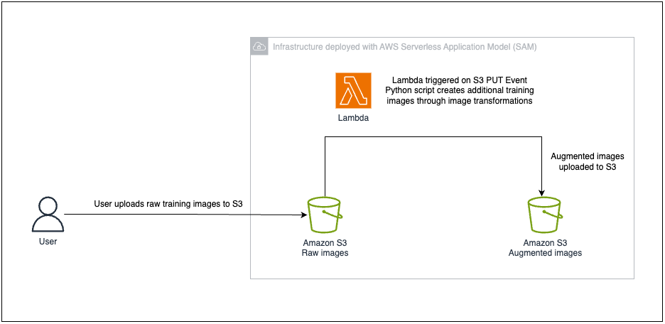

# Serverless image augmentation pipeline to generate additional training data from existing images for machine learning use-cases

## What is this? 

This repository provides a deployable solution using Infrastructure-as-Code (IaC) templates to help you set up a serverless image augmentation pipeline to generate additional training data from existing images for machine learning use-cases.

## Background 

One significant challenge in Machine Learning is obtaining high-quality training data across various applications and domains. The quality and quantity of training data directly influences model performance, generalization, robustness, bias mitigation, and interpretability. Insufficient or low-quality data can hinder a model's ability to learn effectively, generalize to unseen examples, handle diverse conditions, avoid biases, and provide interpretable results.

Image augmentation is a technique of altering the existing data to create more data for the model training process, by applying a variety of transformations to the original images. 

Possible transformations include:
- Rotation: Rotating the image by a certain angle, introducing variations in orientation.
- Scaling: Resizing the image to a different scale, simulating different distances or perspectives.
- Translation: Shifting the image horizontally or vertically, mimicking changes in position.
- Flipping: Mirroring the image horizontally or vertically, creating reflections.
- Shearing: Tilting the image along its axis, introducing distortion.
- Zooming: Zooming in or out of the image, simulating changes in perspective.
- Brightness and Contrast Adjustment: Changing the brightness or contrast of the image, altering lighting conditions.
- Noise Injection: Adding random noise to the image, simulating variations in texture or artifacts.

## Problem Statement 

However, image augmentation poses several challenges during implementation in terms of scalability, performance and cost-efficiency in maintaining the system - especially when training data are huge.

This repository showcases a deployable automated workflow to implement image augmentation mechanisms on a large set of training images using Serverless technologies on AWS.

## Solution Overview



The architecture diagram above showcases the serverless image augmentation pipeline.

The serverless solution is built using [AWS Serverless Application Model (SAM)](https://aws.amazon.com/serverless/aws-sam/#:~:text=The%20AWS%20Serverless%20Application%20Model,databases%2C%20and%20event%20source%20mappings.), an open-source framework for building serverless applications. During deployment, AWS SAM transforms and expands the SAM syntax into AWS CloudFormation syntax, allowing you to easily deploy the entire solution using a few simple commands.

The solution provisions the following AWS resources:
1. S3 Bucket 1 for raw training images
2. S3 Bucket 2 for augmented training images
3. Lambda function written in Python that contains the image transformation logic 
4. Event trigger to execute Lambda function when images are uploaded to S3 bucket 1

## Here's how it works
- Users upload original training images into the S3 bucket for raw images, either in batches or all-at-once.
- The upload operation triggers a Lambda function to be executed against the raw images, with Python code that contains the data transformation logic.
- Depending on the volume of raw images uploaded, Lambda is able to scale out to accommodate the load by provisioning multiple concurrent lambda execution environments for data processing.
- Once the image augmentation process is completed, the end result is being uploaded to another S3 bucket for consumption.

## Deploy the Solution

### Prerequisites

To effectively deploy the project using the AWS SAM Framework, you'd require the following prerequisites:
* [AWS CLI](https://docs.aws.amazon.com/cli/latest/userguide/cli-chap-install.html)
* [AWS SAM CLI](https://docs.aws.amazon.com/serverless-application-model/latest/developerguide/serverless-sam-cli-install-mac.html)

### Deployment Steps

Follow the steps below to deploy the solution using AWS SAM:

1. Clone this project into your local environment 

2. Navigate to the `image_augmentation_sam_app` folder, run `sam build`

3. Upon successful build, deploy the project with `sam deploy --guided`

4. Adapt the image transformation logic to your specific use-case by editing the Python code in `image_augmentation_sam_app/image_augmentation_function/app.py`

```
def generate_augmented_images(original_img, NUM_OF_IMAGES_GENERATED):

    # Insert your image augmentation logic here 

    print("Image augmentation completed!")
    return imgs_distorted
```

_Tip: you can leverage external Python libraries such as [Albumentations](https://github.com/albumentations-team/albumentations) to implement your image augmentation logic_

 ## Resources
 * [AWS Serverless Application Model (SAM) Documentation](https://docs.aws.amazon.com/serverless-application-model/index.html) 
 * [Global sections of the AWS SAM Template](https://docs.aws.amazon.com/serverless-application-model/latest/developerguide/sam-specification-template-anatomy-globals.html)
 * [Working with AWS Lambda and Lambda Layers in AWS SAM](https://aws.amazon.com/blogs/compute/working-with-aws-lambda-and-lambda-layers-in-aws-sam/)

## Clean up 
To remove the solution from your AWS account, follow these steps:
1. Navigate to the `image_augmentation_sam_app` folder, run `sam delete`.

## Security
See CONTRIBUTING for more information.